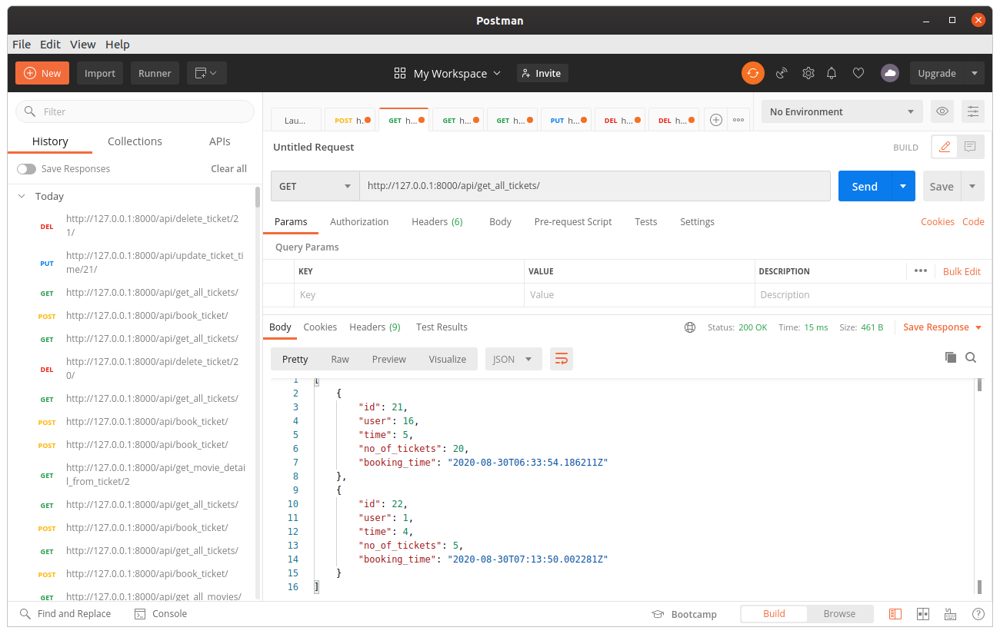
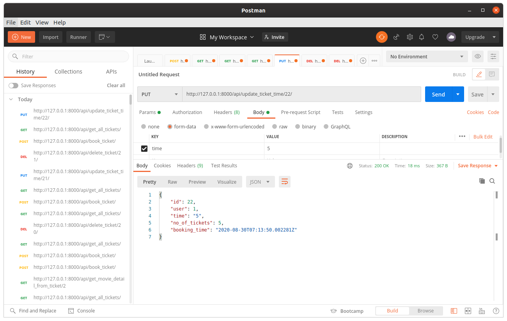
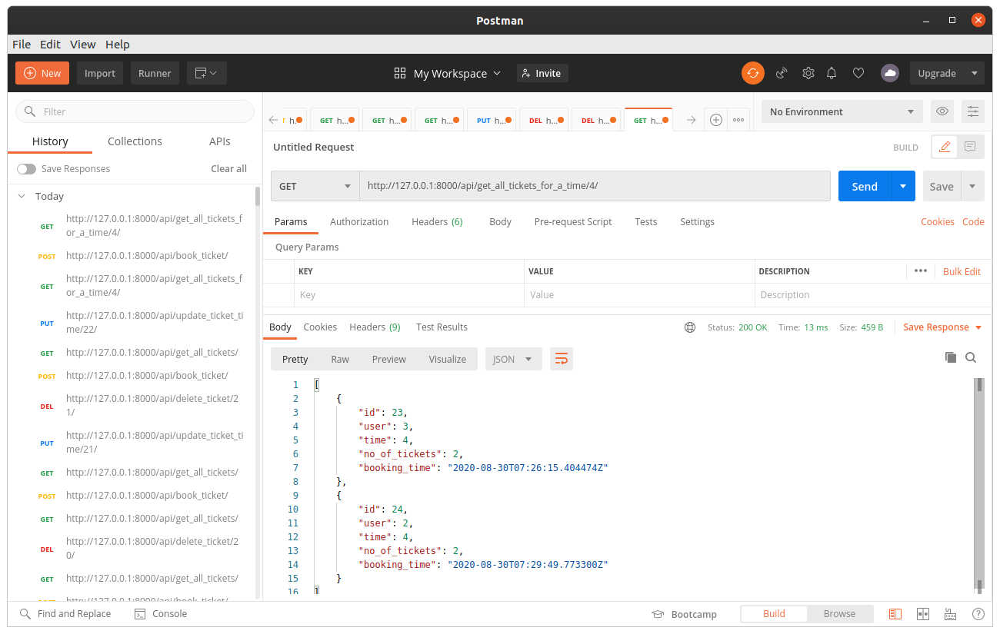
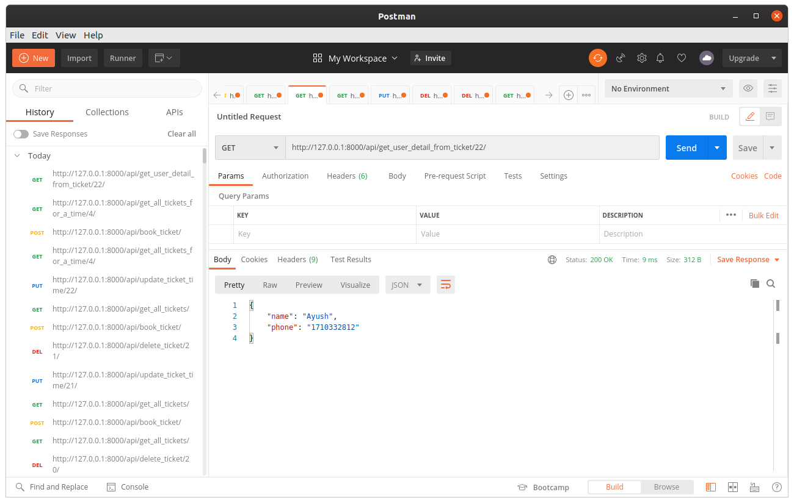
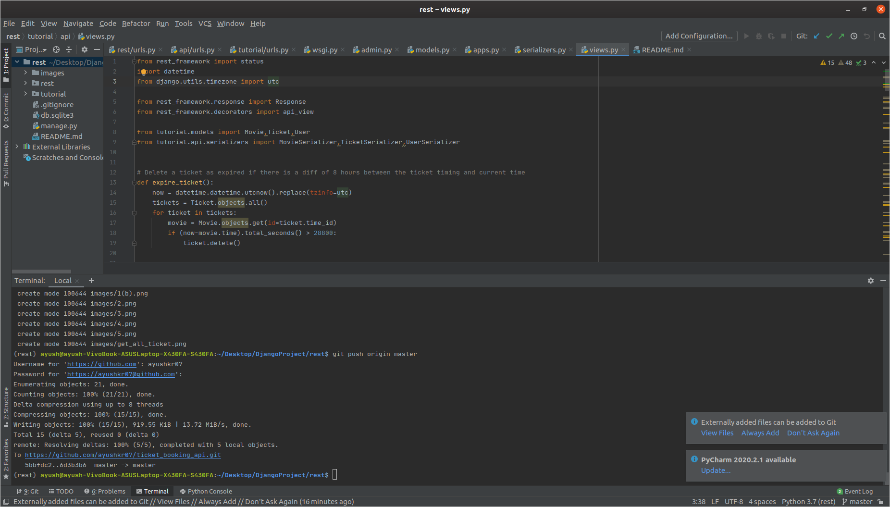

# ticket_booking_api

## Prerequisite..
 - Python-3
 - Django(Backend Framework)
 - Django Restframework(Rest Framework)
 - Pytest(Testing Framework)
 
## Database
  - Sqlite
 
 ## Basic SetUp
1. Install VirtualEnvironment setup : *pip install virtualenvwrapper-win*
2. Create VirtualEnvironment and activating: *mkvirtualenv project*
3. Create new folder : *mkdir pro*
4. clone the repo inside folder(pro): *git clone https://github.com/ayushkr07/ticket_booking_api.git*
5. Install all the dependencies: *pip install -r requirements.txt*
6. Run the project: *python manage.py runserver*

## Testing
  - Write in terminal : *py.test*

## Admin Panel
  - username : test
  - password : Test@123

## Output

#### An endpoint to view all the tickets.

#### An endpoint to book a ticket using a user’s name, phone number, and timings.
.png)
.png)

#### An endpoint to update a ticket timing.

#### An endpoint to view all the tickets for a particular time.

#### An endpoint to delete a particular ticket.

#### An endpoint to view the user’s details based on the ticket id.

#### Auto Expire ticket code.

